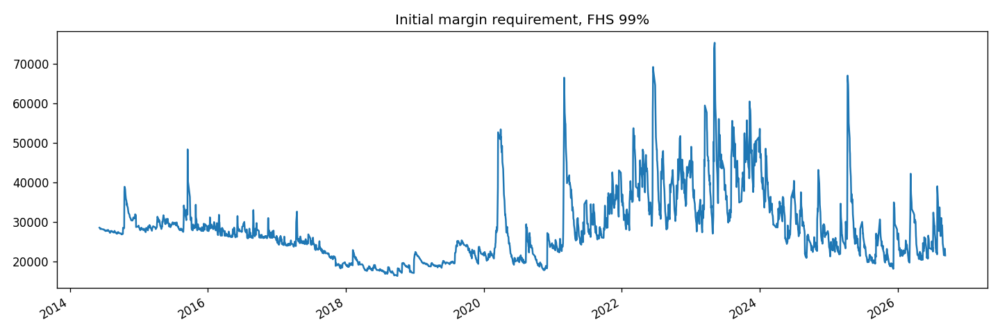
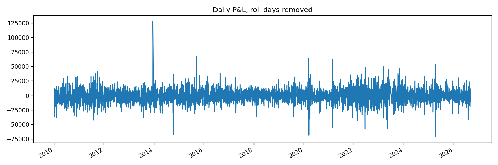

# treasury-basis-margin

# Margin procyclicality in the Treasury cash-futures basis trade

An initial margin model for a leveraged Treasury relative-value position, and a
measurement of how violently that margin moves in stress.

## Motivation

The Treasury cash-futures basis trade accounts for several hundred billion
dollars of hedge fund positioning, funded overwhelmingly through repo. Most
non-centrally-cleared bilateral repo currently carries no haircut at all. The
SEC's clearing mandate moves this activity into a central counterparty, whose
initial margin is set by a volatility-responsive model.

That is a regime change in the *dynamics* of collateral demand, not only in its
level. This project measures those dynamics on a simplified position.

## What this does

1. Constructs a DV01-matched basis position: long cash Treasury exposure,
   short 10-year note futures.
2. Builds a daily P&L series from public data, removing contract roll
   artifacts.
3. Implements a filtered historical simulation (FHS) initial margin model at
   99%, GARCH(1,1)-filtered, estimated out of sample on an expanding window
   refit every 20 trading days.
4. Measures procyclicality: peak-to-trough ratio, largest 1-day and 5-day
   increases, and model calibration via breach rate.

## Results

| Metric | Value |
|---|---|
| Sample | 2010–2026, 3,764 trading days |
| Margin series | from 2014-06-06, 2,764 observations |
| Minimum-variance hedge ratio | 93.3 contracts (vs 100 from DV01 matching) |
| Hedge variance reduction | 71.0% |
| GARCH parameters | α = 0.115, β = 0.800 (persistence 0.915) |
| Breach rate | 1.19% against a 1.00% target |
| Peak-to-trough margin ratio | 4.60 |
| Largest 1-day margin increase | 78.7% |
| Largest 5-day margin increase | 173.9% |

**Calibration.** 33 breaches were observed where 27.6 were expected. That
difference is within sampling error at this sample size, so the model is not
meaningfully undermargining.

**Persistence.** α + β = 0.915 means a volatility shock continues to elevate
the margin requirement for months after the event. This is the mechanism
behind the peak-to-trough ratio: margin does not fall back as quickly as it
rises.

**The largest margin increases cluster on identifiable events rather than on
noise.** The five largest one-day increases:

| Date | Increase | Event |
|---|---|---|
| 2026-07-30 | 78.7% | [FILL THIS IN] |
| 2023-05-05 | 62.9% | regional banking stress |
| 2021-03-01 | 62.8% | late-February duration selloff, weak 7-year auction |
| 2023-05-30 | 61.2% | debt ceiling standoff |
| 2022-06-14 | 60.8% | ahead of the FOMC's 75bp hike, after the May CPI print |

A position that has not changed at all can therefore face a margin call
approaching double the previous day's requirement, precisely when funding
markets are tightest.





## Data

- 10-year constant maturity Treasury yield : FRED, series `DGS10`
- 10-year Treasury note future : Yahoo Finance, `ZN=F`

Both free and publicly available. No proprietary data is used.

## Assumptions and limitations

Stated plainly, because they matter for how the results should be read.

- The cheapest-to-deliver bond and its conversion factor are not modelled;
  duration is held constant rather than recomputed daily. The fitted hedge
  ratio implies a duration of about 7.3 against the 7.5 assumed.
- `ZN=F` is a back-adjusted continuous series. Roll weeks in March, June,
  September and December are excluded, which also removes genuine trading days.
- `DGS10` is a constant-maturity par yield, not the yield of a deliverable
  bond. Part of the residual hedge error is therefore measurement mismatch
  rather than true basis risk.
- Repo financing cost and coupon carry are omitted: this is a price P&L.
- The margin period of risk is one day. Central counterparties use longer.
- No comparison against bilateral repo haircut dynamics yet.

## Next steps

- Extend the margin period of risk beyond one day
- Compare cleared initial margin against bilateral haircut practice for the
  same position
- Quantify the cross-margining offset between the futures and repo legs

## Running it

```
pip install pandas numpy yfinance pandas-datareader arch matplotlib
```

Open `basis_margin.ipynb` and run all cells. Data is downloaded at runtime.

## Author

Sofya Pauzin, École Polytechnique
